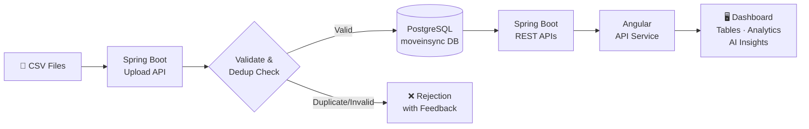
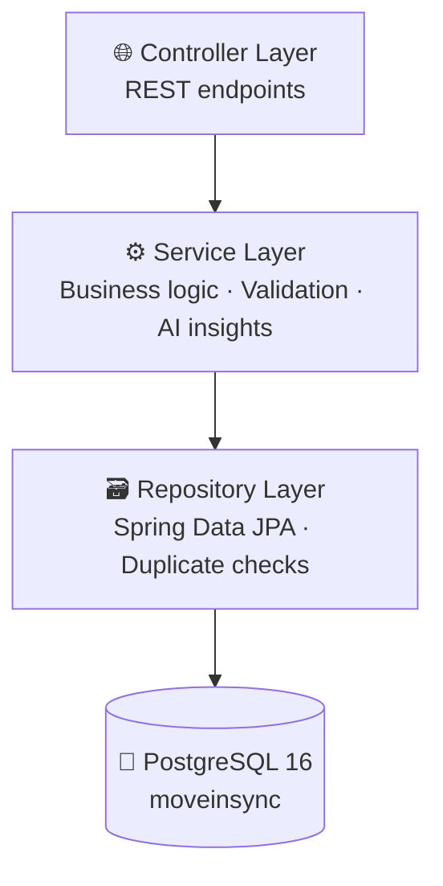
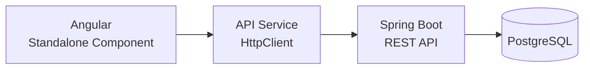

<div align="center">
  
  <br/><br/>

  <a href="https://spring.io/projects/spring-boot"></a>
  <a href="https://angular.io"></a>
  <a href="https://www.postgresql.org"></a>
  <a href="https://openjdk.org"></a>
  <a href="https://docs.docker.com/compose"></a>
  

  <br/><br/>

  <h1>🚌 MoveInSync Intelligence</h1>
  <p><strong>Agentic AI platform for Enterprise Mobility & Operations Intelligence</strong></p>
  <p>Upload trip CSVs → Validate & store → Surface real-time analytics, anomaly detection, and AI-generated insights on a live Angular dashboard.</p>

  <br/>

  <a href="#-features">Features</a> ·
  <a href="#-current-dataset">Live Stats</a> ·
  <a href="#-architecture">Architecture</a> ·
  <a href="#-quick-start">Quick Start</a> ·
  <a href="#-api-reference">API Reference</a> ·
  <a href="#-troubleshooting">Troubleshooting</a>

</div>

---

## ✨ Features

<table>
<tr>
<td width="50%" valign="top">

### 📊 Dashboard
- Total trips, active vehicles, on-time %
- Delayed trips count & breakdown
- Employees transported
- Route utilisation percentage

### 🚗 Ride Management
- List, search, filter, sort & paginate rides
- View full ride details in a modal
- Retrieve rides by Trip ID

### 📁 CSV Upload
- Upload ride & employee data
- Server-side validation on ingestion
- Duplicate Trip ID detection & rejection
- Real-time upload status feedback

</td>
<td width="50%" valign="top">

### 📈 Analytics & Insights
- Operational anomaly detection
- AI-generated actionable insights
- Delay reason analysis
- Route & vehicle utilisation metrics

### 🖥️ User Interface
- Responsive Angular standalone-component dashboard
- Interactive data tables with search & filter
- Pagination for large datasets
- Ride detail modal
- SCSS dark-mode styling

</td>
</tr>
</table>

---

## 📊 Current Dataset

> [!NOTE]
> These values reflect the currently imported dataset and update automatically after new CSV uploads.

<div align="center">

| Metric | Value |
|:---:|:---:|
| 🛣️ Total Trips | **400** |
| 🚌 Active Vehicles | **230** |
| ✅ On-Time Percentage | **97.5%** |
| ⚠️ Delayed Trips | **10** |
| 👥 Employees Transported | **1,189** |
| 📍 Route Utilization | **121.2%** |

</div>

---

## 🏗 Architecture

### Application Flow



### Backend Layers



### Frontend Layers



---

## 🛠 Tech Stack

| Layer | Technology |
|---|---|
| **Backend** | Java 21 · Spring Boot 4.1.1 · Spring Data JPA · Gradle 8 |
| **Frontend** | Angular 22 · Angular CDK · TypeScript · SCSS |
| **Database** | PostgreSQL 16 (Docker container) |
| **Infrastructure** | Docker · Docker Compose |
| **API Style** | REST / JSON |

---

## 📁 Project Structure

```
moveinsync-intelligence/
├── backend/
│   ├── src/main/java/com/moveinsync/intelligence/
│   │   ├── controller/         # REST endpoints (rides, uploads, dashboard)
│   │   ├── service/            # Business logic, anomaly detection, AI insights
│   │   ├── repository/         # Spring Data JPA + duplicate trip ID checks
│   │   ├── entity/             # JPA models: Ride, Employee
│   │   └── dto/                # Request/Response DTOs
│   ├── src/main/resources/
│   │   └── application.properties
│   ├── build.gradle
│   └── gradlew
├── frontend/
│   ├── src/app/
│   │   ├── services/
│   │   │   └── api.service.ts  # HTTP client → all backend endpoints
│   │   ├── app.html            # Dashboard template
│   │   └── app.scss            # Responsive dark-mode styles
│   ├── angular.json
│   └── package.json
└── infra/
    └── docker-compose.yml
```

---

## 🚀 Quick Start

### Prerequisites

- Java 21+
- Node.js 20+ & npm 11+
- Docker Desktop (running)

---

### Step 1 — Database

<details>
<summary><b>🐳 Start existing PostgreSQL container</b></summary>

```bash
docker start moveinsync-postgres
```

</details>

<details>
<summary><b>🆕 Create container (first-time setup)</b></summary>

**macOS / Linux**
```bash
docker run --name moveinsync-postgres \
  -e POSTGRES_DB=moveinsync \
  -e POSTGRES_USER=moveinsync \
  -e POSTGRES_PASSWORD=moveinsync_dev_password \
  -p 5432:5432 \
  -d postgres:16
```

**Windows (CMD / PowerShell)**
```bat
docker run --name moveinsync-postgres ^
  -e POSTGRES_DB=moveinsync ^
  -e POSTGRES_USER=moveinsync ^
  -e POSTGRES_PASSWORD=moveinsync_dev_password ^
  -p 5432:5432 ^
  -d postgres:16
```

</details>

<details>
<summary><b>✅ Verify container is running</b></summary>

```bash
docker ps
# You should see moveinsync-postgres with status "Up"
```

</details>

---

### Step 2 — Backend

```bash
# macOS / Linux
cd moveinsync-intelligence/backend
./gradlew bootRun

# Windows
cd C:\moveinsync-intelligence\backend
.\gradlew.bat bootRun
```

Backend runs at → **`http://localhost:8080`**

```bash
# Verify
curl http://localhost:8080/api/health
```

---

### Step 3 — Frontend

```bash
# macOS / Linux
cd moveinsync-intelligence/frontend
npm install
npm start

# Windows
cd C:\moveinsync-intelligence\frontend
npm install
npm start
```

App runs at → **`http://localhost:4200`**

<details>
<summary><b>📦 Production build</b></summary>

```bash
npm run build
```

> [!TIP]
> The dashboard SCSS file is large. To prevent Angular's style budget from failing the build, ensure `frontend/angular.json` contains:
> ```json
> {
>   "type": "anyComponentStyle",
>   "maximumWarning": "16kB",
>   "maximumError": "32kB"
> }
> ```

</details>

---

## 📡 API Reference

**Base URL:** `http://localhost:8080`

| Method | Endpoint | Description |
|:---:|---|---|
| `GET` | `/api/health` | Backend health check |
| `GET` | `/api/dashboard/summary` | All dashboard metrics |
| `GET` | `/api/rides` | All rides (paginated, sortable) |
| `GET` | `/api/rides/{id}` | Single ride by ID |
| `GET` | `/api/rides/trip/{tripId}` | All rides for a Trip ID |
| `POST` | `/api/uploads/rides` | Upload ride data CSV |
| `POST` | `/api/uploads/employees` | Upload employee data CSV |

<details>
<summary><b>📋 curl examples</b></summary>

```bash
# Health check
curl http://localhost:8080/api/health

# Dashboard summary
curl http://localhost:8080/api/dashboard/summary

# All rides
curl http://localhost:8080/api/rides

# Single ride
curl http://localhost:8080/api/rides/1

# Rides for a trip
curl http://localhost:8080/api/rides/trip/TRIP_ID

# Upload ride CSV
curl -X POST -F "file=@rides.csv" http://localhost:8080/api/uploads/rides

# Upload employee CSV
curl -X POST -F "file=@employees.csv" http://localhost:8080/api/uploads/employees
```

</details>

---

## 🗂 Ride Data Fields

<details>
<summary><b>View all 29 fields</b></summary>

| Field | Description |
|---|---|
| Ride ID | Unique ride record identifier |
| Business Unit | Organisational unit associated with the trip |
| Office | Office / campus served |
| Product Type | Cab type / product category |
| Trip Date | Date of the trip |
| Shift Type | Morning / evening / night shift indicator |
| Trip ID | Logical grouping identifier for the trip |
| Trip Direction | Pick-up or drop direction |
| Actual Escort | Escort assigned to the trip |
| Vendor ID | Transport vendor identifier |
| Planned Cab Registration | Registration of the scheduled vehicle |
| Actual Cab Registration | Registration of the vehicle that operated |
| Actual Cab Capacity | Seating capacity of the actual cab |
| Planned Kilometres | Expected trip distance |
| Travelled Kilometres | Actual distance covered |
| Planned Start Epoch | Scheduled start time (Unix timestamp) |
| Planned End Epoch | Scheduled end time (Unix timestamp) |
| Actual Start Epoch | Actual start time (Unix timestamp) |
| Actual End Epoch | Actual end time (Unix timestamp) |
| Delay Reason | Categorised reason for delay (if any) |
| Delay Minutes | Minutes delayed beyond schedule |
| Route Source | Origin point of the route |
| Actual Cab Fuel Type | Fuel type of the operating vehicle |
| Driver Non-Compliance | Flag for driver policy violations |
| Cab Non-Compliance | Flag for vehicle policy violations |
| Trip Nodal Information | Pickup / drop node details |
| Planned Employee Count | Employees scheduled for the trip |
| Actual Employee Count | Employees who boarded |
| No-Show Count | Scheduled employees who did not board |

</details>

---

## 🔄 Duplicate Handling

The backend performs **repository-level deduplication** on every CSV upload:

- Checks for existing Trip IDs **before** inserting new records
- Retrieves existing Trip IDs in **batches** for efficient bulk validation
- Rejects duplicates and returns clear error feedback to the caller
- Guarantees data consistency across repeated or incremental uploads

---

## 🗃 Database Configuration

| Property | Value |
|---|---|
| Container | `moveinsync-postgres` |
| Database | `moveinsync` |
| Username | `moveinsync` |
| Password | `moveinsync_dev_password` |
| Port | `5432` |

---

## 🔍 Troubleshooting

<details>
<summary><b>🔴 Backend does not start</b></summary>

```bash
# Check PostgreSQL is running
docker ps

# Start if stopped
docker start moveinsync-postgres
```

Also verify:
- Port `5432` is free (PostgreSQL)
- Port `8080` is free (Spring Boot)
- Credentials in `application.properties` match the container
- Backend logs show no `DataSource` connection errors

</details>

<details>
<summary><b>🟠 Frontend cannot load data</b></summary>

1. Confirm backend: `curl http://localhost:8080/api/health`
2. Confirm frontend is on port `4200`
3. Check `frontend/src/app/services/api.service.ts` for the correct base URL
4. Open browser DevTools → **Console** for CORS errors
5. Open browser DevTools → **Network** to inspect API responses

</details>

<details>
<summary><b>🟡 Frontend build fails (SCSS budget error)</b></summary>

Confirm `frontend/angular.json` contains:

```json
{
  "type": "anyComponentStyle",
  "maximumWarning": "16kB",
  "maximumError": "32kB"
}
```

Then run:

```bash
npm run build
```

</details>

<details>
<summary><b>🔵 Dashboard shows empty data</b></summary>

> [!IMPORTANT]
> Data only appears after uploading CSVs through the Upload page.

1. Upload ride and employee CSVs via the UI
2. Verify records exist: `SELECT COUNT(*) FROM rides;` in PostgreSQL
3. Check the browser console for API errors
4. Refresh the page after a successful upload

</details>

<details>
<summary><b>⚫ PostgreSQL container is missing</b></summary>

Re-create it using the first-time setup command in [Step 1](#step-1--database).

</details>

---

## 🔮 Future Enhancements

- [ ] Real-time vehicle tracking (WebSockets / SSE)
- [ ] Advanced route optimisation engine
- [ ] ML-based anomaly detection models
- [ ] Role-based access control (RBAC)
- [ ] OAuth2 / JWT authentication & authorisation
- [ ] Dashboard report export (PDF / Excel)
- [ ] Advanced visualisations (D3.js / Apache ECharts)
- [ ] Automated scheduled data ingestion (cron jobs)
- [ ] Production deployment configuration (Kubernetes / Cloud Run)
- [ ] Gemini / GPT LLM recommendation integration
- [ ] Historical trend analysis
- [ ] Vendor performance analytics dashboard
- [ ] Predictive delay detection model
- [ ] Carbon footprint analytics per route

---

<div align="center">

*Built for demonstration and development purposes · MoveInSync Intelligence · Hackathon 2026*

</div>
